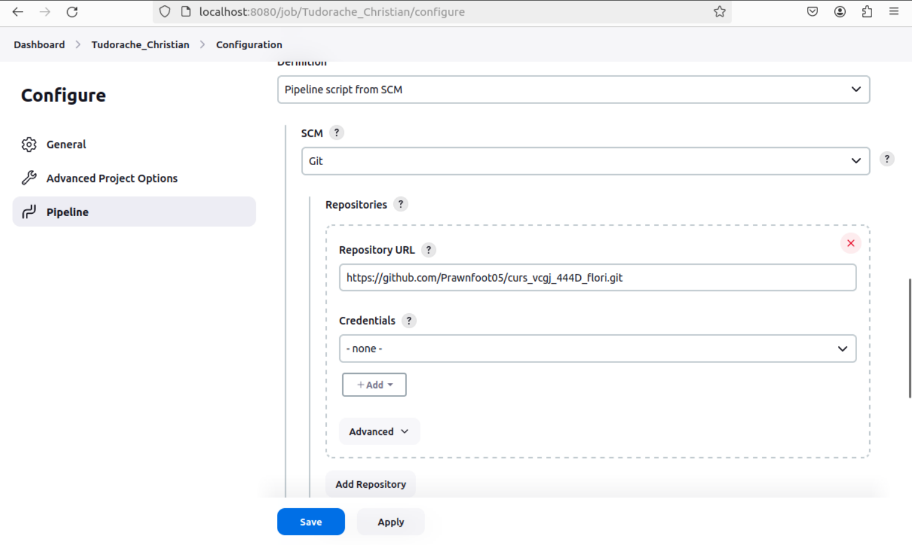

# Curs_CVGJ_24_flori - Lavanda

Am urmat pasii prezentati in platforma, conectandu-ma la gitHub, la repository-ul creat grupei noastre

Am creat functiile de python necesare, reprezentand caracteristici ale lavandei, pe care apoi le-am apelat in cadrul unei pagini HTML pentru rezultatul final, rulat din Firefox local:

Am scris codul necesar rularii de teste automat prin Jenkins, insa nu am putut rula pana la capat din cauza faptului ca nu am putut instala Blue Ocean.

