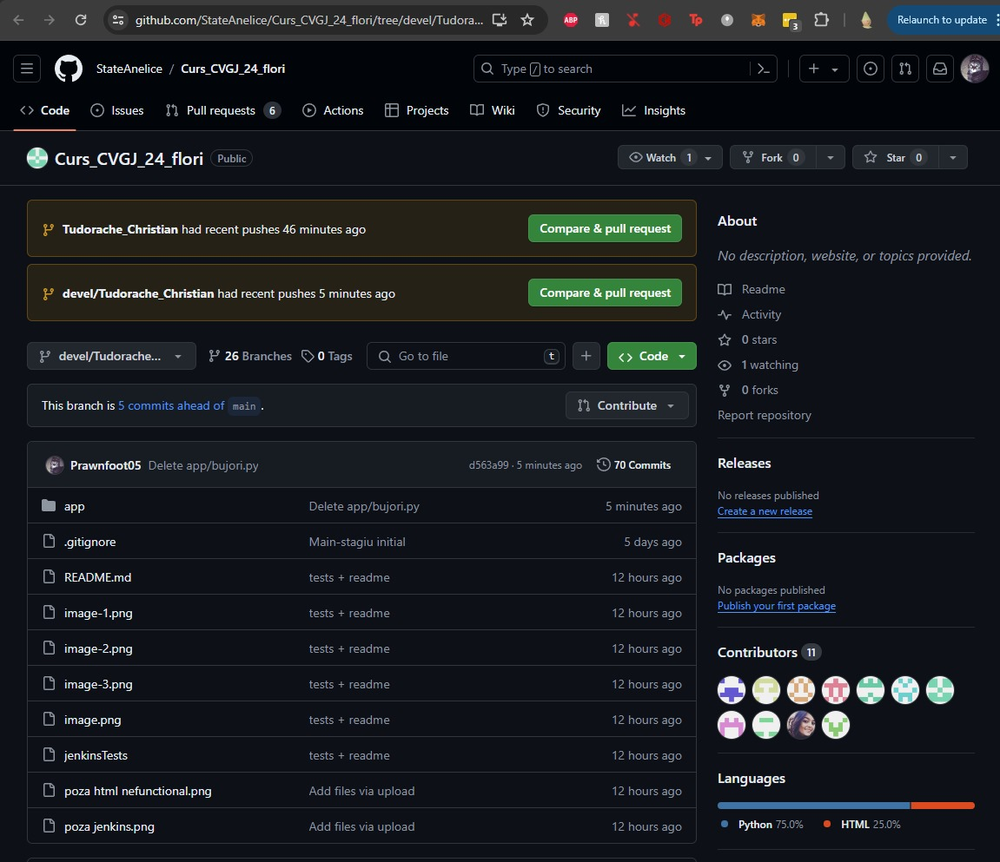
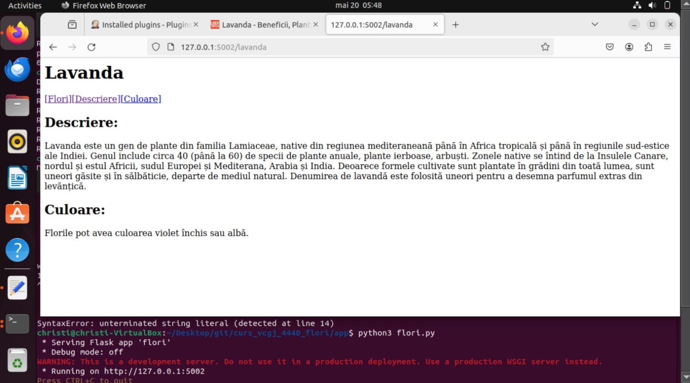

# Curs_CVGJ_24_flori - Bujori

Am urmat pasii prezentati in platforma, conectandu-ma la gitHub, la repository-ul creat grupei noastre

Am creat functiile de python necesare, reprezentand caracteristici ale florii alese, si anume bujorul, pe care apoi le-am apelat alaturi de o pagina html creata de mine si folosind flask am creat 

