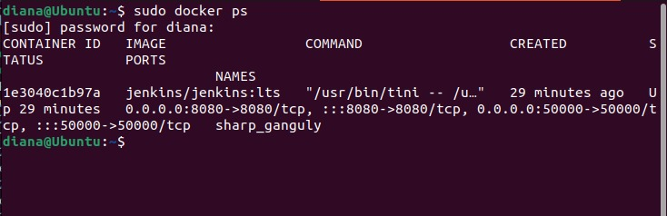
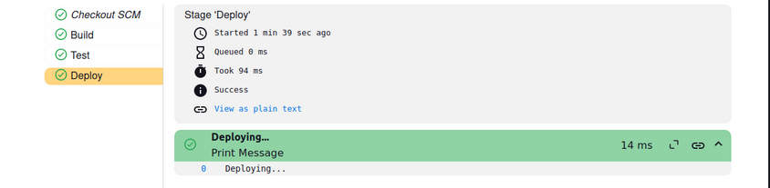

# Curs_CVGJ_24_flori

Descriere
Acest proiect este o aplicație web simplă creată cu ajutorul framework-ului Flask. Aplicația conține mai multe rute care redirecționează utilizatorul către diverse pagini HTML stocate în directorul Cioroiu_Diana.
Cerințe
•	Python 3.x
•	Flask
Structura Proiectului
•	app.py: Fișierul principal al aplicației.
•	templates/: Directorul unde sunt stocate fișierele HTML.
•	Cioroiu_Diana/: Subdirectorul care conține fișierele HTML.
•	index.html: Pagina principală.
•	poze.html: Pagina pentru poze.
•	preturi.html: Pagina pentru prețuri.
Utilizare
1.	Rulare aplicație:
python app.py
2.Accesare aplicație: Deschide un browser și navighează la http://127.0.0.1:5000/
Rutele Aplicației
•	/: Ruta principală care redirecționează către index.html.
•	/poze: Ruta care redirecționează către poze.html.
•	/preturi: Ruta care redirecționează către preturi.html.
import sys
import os
from flask import Flask, url_for, render_template

app = Flask(_name_)

@app.route("/")
def index():
    return render_template('Cioroiu_Diana/index.html')

@app.route("/poze")
def poze():
    return render_template('Cioroiu_Diana/poze.html')

@app.route("/preturi")
def preturi():
    return render_template('Cioroiu_Diana/preturi.html')

if _name_ == "_main_":
    app.run(debug=True)

Contribuții
Orice contribuții sunt binevenite! Te rugăm să deschizi un pull request pentru a contribui la acest proiect.