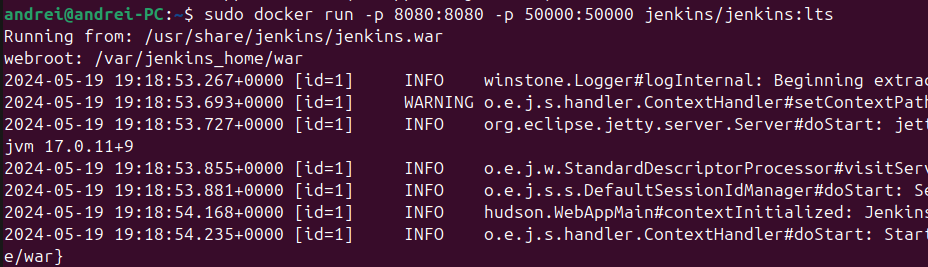
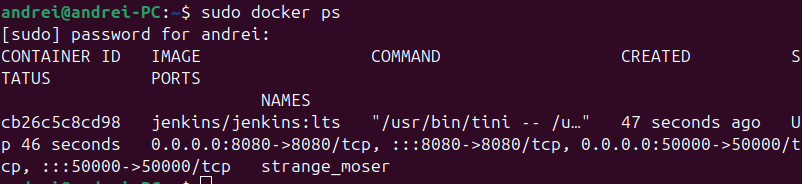

# Curs_CVGJ_24_flori



# Aplicația Web Flask pentru Trandafiri

Aceasta este o aplicație web simplă realizată cu Flask, care servește trei pagini HTML diferite despre "trandafiri".

## Structura Proiectului


## Configurare și Instalare

1. **Clonează depozitul** (dacă este găzduit pe un sistem de control al versiunilor precum GitHub):

    ```bash
    git clone https://github.com/StateAnelice/Curs_CVGJ_24_flori.git
    cd your_flask_app
    ```

2. **Creează un mediu virtual** (opțional, dar recomandat):

    ```bash
    python3 -m venv venv
    source venv/bin/activate
    ```

3. **Instalează dependențele**:

    ```bash
    pip install Flask
    ```

## Rularea Aplicației

1. **Setează variabila de mediu** (opțional, dar recomandat pentru dezvoltare):

    ```bash
    export FLASK_APP=app.py
    export FLASK_ENV=development 
    ```

    Pe Windows, folosește `set` în loc de `export`.

2. **Rulează aplicația Flask**:

    ```bash
    flask run
    ```

3. **Deschide browserul web** și mergi la `http://127.0.0.1:5000/`.

## Rutele Aplicației

- **`/`**: Servește șablonul `trandafir.html`.
- **`/descriere`**: Servește șablonul `descriere_trandafir.html`.
- **`/poze`**: Servește șablonul `poze_trandafir.html`.

## Șabloane

Pune șabloanele tale HTML în directorul `templates`:

- `trandafir.html`: Pagina principală.
- `descriere_trandafir.html`: Pagină cu descrierea trandafirilor.
- `poze_trandafir.html`: Pagină cu poze ale trandafirilor.