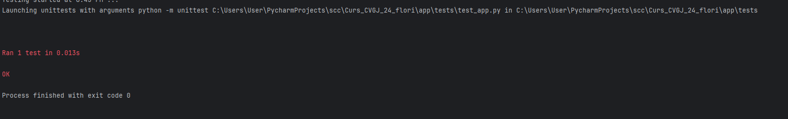
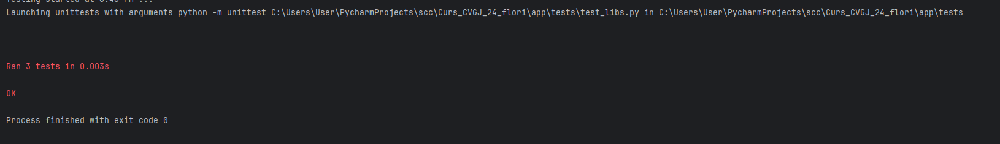

# Curs_CVGJ_24_flori - Garoafa

1. Am urmat pasii prezentati in platforma, conectandu-ma la gitHub, la repository-ul creat pentru grupa noastra si l-am descarcat folosind git clone.

2. Am creat functiile de python necesare, reprezentand caracteristici ale florii alese, si anume garoafa.

    Prezentare pagina principala html:

    

3. Am facut functii pentru teste ca sa verificam functionarea librariei si paginii web:

test_app.py:

test_libs.py:

4. Rezultatele testelor:

test_app.py:

test_libs.py:

