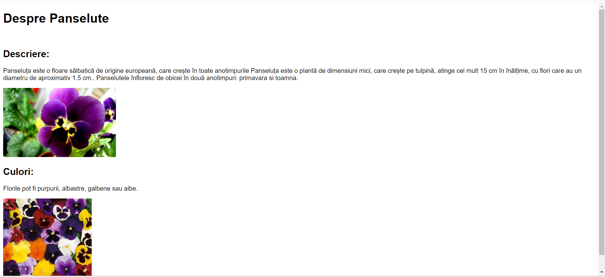
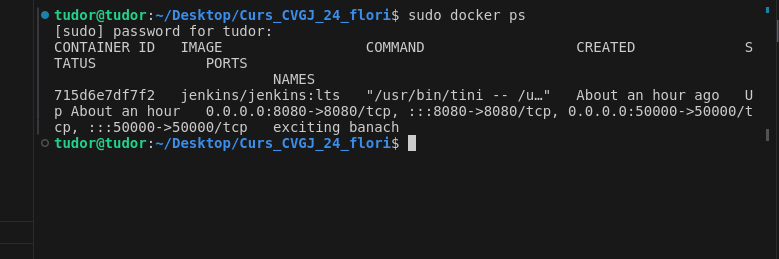
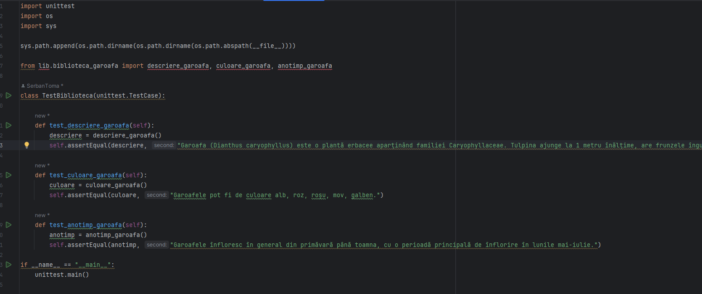

# Curs_CVGJ_24_flori - Bujori

Am urmat pasii prezentati in platforma, conectandu-ma la gitHub, la repository-ul creat respectiv grupei noastre

Am creat functiile de python necesare, reprezentand caracteristici ale florii alese, si anume bujorul, pe care apoi le-am apelat alaturi de o pagina html creata de mine si folosind flask am creat 

Am facut functii pentru teste ca sa verificam functionarea librariei si paginii web, teste ce au si trecut

Am creat pipeline in jenkins si am rulat fisierul jenkins, dupa care am containeizat in docker